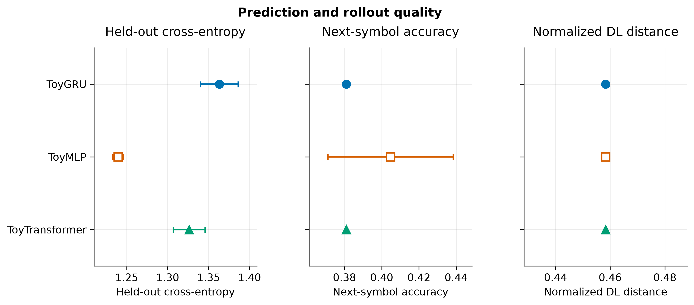
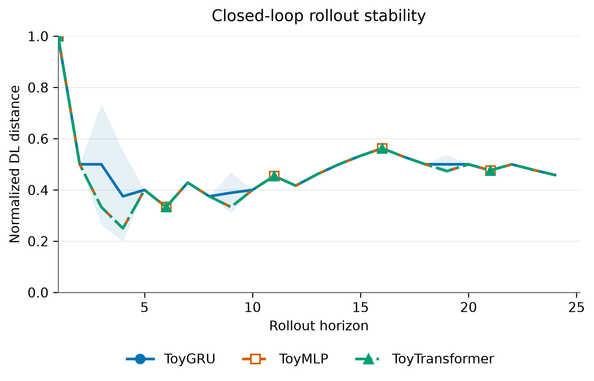
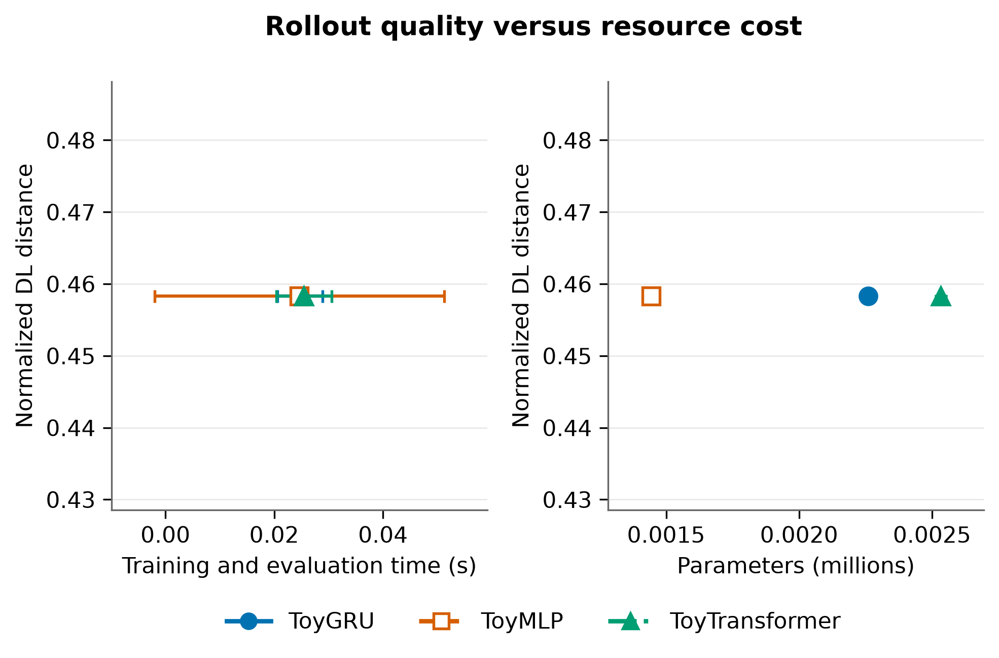
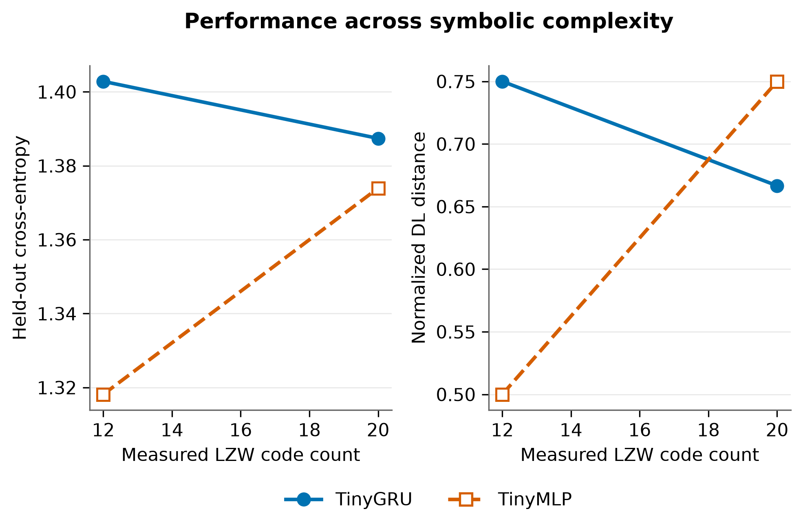

Results and Visualization
=========================

A saved custom run is a directory, not only a summary table. The same run
can be inspected, reloaded, and plotted without retraining:

.. code-block:: text

   rote_runs/run-<UTC time>-<id>/
   |-- config.json          # model names, seed, EvaluationConfig, software versions
   |-- manifest.json        # running, complete, or failed; completed/total
   |-- records.jsonl        # one full record appended after each evaluation
   |-- results.csv          # cumulative, atomically replaced after each evaluation
   |-- events.jsonl         # start, completion, and failure events
   `-- figures/
       |-- quality.png / quality.pdf
       |-- rollout.png / rollout.pdf
       |-- tradeoffs.png / tradeoffs.pdf
       `-- visualization.json

The default run root is ``./rote_runs``; set ``ROTE_RUNS_DIR`` to change
it. Each run receives a unique directory. An explicit ``output_dir`` must
not exist, so a previous benchmark cannot be overwritten accidentally.
``load_run(path)`` returns a ``SavedRun`` with ``.config``,
``.manifest``, and ``.results``. JSONL records are authoritative if
training is interrupted between updating the record log and the CSV.
A failed run retains all completed evaluations and records the exception in
``manifest.json`` and ``events.jsonl``.

.. code-block:: python

   from rote_benchmark.artifacts import load_run
   from rote_benchmark.visualization import PlotStyle, visualize_benchmark

   saved = load_run("rote_runs/run-20260923T120000Z-a1b2c3d4")
   print(saved.manifest["status"], saved.results[["model", "DL"]])
   report = visualize_benchmark(
       saved,
       style=PlotStyle(font_family="DejaVu Sans", font_size=11,
                       uncertainty="std", formats=("pdf", "png")),
   )
   print(report.figures["quality"])
   print(report.config_path)

``visualize_benchmark`` also accepts a run directory, a ``results.csv``
path, or a pandas DataFrame. When given a saved run, figures default to its
``figures/`` subdirectory. For CSV or DataFrame input, a unique directory
is created under ``./rote_figures`` (or ``ROTE_FIGURES_DIR``).
Use ``output_dir`` to choose a figure directory explicitly.
Existing figure files are protected; pass ``overwrite=True`` when you
intentionally regenerate them with a new style.

Figure set
----------

The default report includes every figure supported by the supplied columns:

* ``quality``: point-and-error panels for held-out loss, next-symbol
  accuracy, and full-horizon normalized DL distance.
* ``rollout``: prefix DL over rollout horizon, with sparse markers and
  uncertainty bands. Requires target and forecast strings.
* ``tradeoffs``: DL versus training time, parameter count, and CUDA
  allocation when those columns exist. CPU runs have no CUDA-memory panel.
* ``complexity``: one-step and rollout metrics versus *measured* LZW
  code count. Requires at least two distinct complexities.

Select a subset with ``figures=("quality", "tradeoffs")``. The figures
share model colors, markers, line styles, type, and legend layout. Means are
computed from the supplied rows; ``uncertainty="std"`` shows one sample
standard deviation, ``"sem"`` shows standard error of the mean, and
``"none"`` suppresses uncertainty. These are descriptive summaries,
**not confidence intervals**. Treat generated seeds as the independent
unit if making across-seed statistical claims. Parameter and memory
measurements may differ substantially across architectures; read the cost
axes together with quality.

Custom appearance
-----------------

``PlotStyle`` exposes ``font_family``, ``font_size``,
``title_size``, ``figure_size``, ``dpi``, ``palette``,
``model_colors``, ``markers``, ``linestyles``,
``marker_size``, ``line_width``, ``legend_columns``,
``legend_y``, ``horizon_marker_step``, ``log_cost_axes``,
``quality_metrics``, ``complexity_metrics``, ``cost_metrics``,
``uncertainty``, and output ``formats``. Matplotlib settings are
scoped to each plot and do not change the caller's global style.

.. code-block:: python

   from rote_benchmark.visualization import PlotStyle, visualize_benchmark

   report = visualize_benchmark(
       "my_run",
       output_dir="my_run/figures_large",
       style=PlotStyle(
           font_family="DejaVu Sans", font_size=12, title_size=14,
           marker_size=8, line_width=2.3,
           model_colors={"MyNetwork": "#0072B2"},
           uncertainty="sem", formats=("pdf", "svg"),
           horizon_marker_step=4, log_cost_axes=True,
       ),
       figures=("quality", "rollout", "tradeoffs"),
   )

For a one-off adjustment, ``plot_model_comparison``,
``plot_rollout_error``, ``plot_tradeoffs``, and
``plot_complexity_sweep`` return Matplotlib ``Figure`` objects.
Save them yourself after adjusting axes or labels. The coordinated API
writes ``visualization.json`` to record the settings used for its figures.

Replot without retraining
-------------------------

.. code-block:: bash

   python examples/plot_saved_results.py /tmp/rote-toys \
     --output-dir /tmp/rote-toys/figures_large \
     --font-size 12 --uncertainty sem --formats pdf svg

.. literalinclude:: ../../examples/plot_saved_results.py
   :language: python

The following toy figures are examples of the output format, not manuscript
results. The first two come from two runs with three epochs per model. The
complexity figure comes from the two-seed example with one run and one epoch.
These tiny settings only verify the workflow; they do not support model
rankings.

   Teacher-forced and closed-loop quality of three toy architectures.

   Closed-loop degradation over a 24-symbol horizon.

   The same toy run viewed against runtime and model size; CPU execution
   has no CUDA-allocation panel.

   Two-seed complexity sweep; lines join measured LZW code counts.

The specialized manuscript figures are produced by ``rote-plot`` and
``rote-plot-matched`` from the fixed-budget and matched-size experiment
tables described in :doc:`experiments`. Those scripts and their archived
results are separate from the custom-model visualization API.
